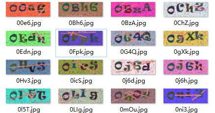
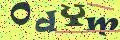
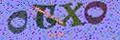
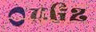

## 计算机挑战赛 2019 验证码识别竞赛 一等奖方案


### <center>1. Background</center>

基于<https://github.com/dee1024/pytorch-captcha-recognition>进行改进，原版中数据集采用的captcha库自动生成的图片，可以随意制定生成数量，并且相对而言生成的图片比较简单。

本次项目是全国高校计算机能力挑战赛中的人工智能赛道里的验证码识别，该比赛需要识别26（大写）+26（小写）+数字（10）= 62个字符，随机组成的四位验证码图片。训练集仅有5000张，并且识别的难度系数较大，人眼有时候也很容易识别出错。


### <center>2. Environment</center>

- 显存：4G+

- Ubuntu16.04

- numpy

- pandas

- torch==1.3.1

- torchnet==0.0.4

- torchvision==0.2.0

- tqdm

- visdom

> 可通过pip install -r requirements.txt进行环境的安装

### <center>3. Dataset</center>



比赛提供的数据集如图所示，120$\times$40的像素的图片，然后标签是由图片名称提供的。训练集测试集划分：80%的数据用于训练集，20%的数据用于测试集。

- 训练图片个数为：3988

- 测试图片个数为：1000

训练的数据还是明显不够的，考虑使用数据增强，通过查找github上很多做数据增强的库，最终选择了Augmentor库作为图像增强的库。

安装方式：`pip install Augmentor`

API: <https://augmentor.readthedocs.io/en/master/index.html>

由于验证码与普通的分类图片有一定区别，所以选择的增强方式有一定局限，经过几轮实验，最终选取了distortion类的方法作为具体增强方法，输入为训练所用的图片，输出设置为原来图片个数的2倍，具体代码见dataAug.py, 核心代码如下：

```python
def get_distortion_pipline(path, num):
    p = Augmentor.Pipeline(path)
    p.zoom(probability=0.5, min_factor=1.05, max_factor=1.05)
    p.random_distortion(probability=1, grid_width=6, grid_height=2, magnitude=3)
    p.sample(num)
    return p
```

将得到的图片重命名为auged_train文件夹，最终数据集组成如下：

```
root 
	- data
		- train:3988张
		- test:1000张
		- auged_train:7976张
```

> 如果需要数据集请联系我，联系方式在最后
>
> 链接：https://pan.baidu.com/s/13BmN7Na4ESTPAgyfBAHMxA 
> 提取码：v4nk

数据集结构的组织,从网盘下载数据以后，按照以下文件夹格式进行组织：

```
- data
	- train
	- test
	- auged_train
```

然后就可以训练了。

### <center>4. Structure</center>

```
root 
	- config
		- parameters.py 主要包括超参数，最重要的是learning rate
	- lib
		- center_loss.py 将center loss引入，用于训练
		- dataset.py 包装Dataset，针对train文件夹和auged_train文件夹内容各自写了一个处理类
		- generate_captcha.py 生成简单的数据集，在没有官方数据集的情况下
		- optimizer.py RAdam, AdamW, label smooth等新的optimizer
		- scheduler.py 新增了warmup机制
	- model
		- BNNeck.py 基于resnet18使用了bnnect结构，来自罗浩大佬行人检测中的trick
		- CaptchaNet.py 手工构建的一个简单网络，原有库提供的
		- dense.py 更改backbone，使用dense121作为backbone，其他也可以更改
		- dualpooling.py 在resnet18基础上添加了dual pooling，增加了信息
		- IBN.py 使用ibn模块，以resnet18为基础
		- model.py resnet18，添加dropout
		- res18.py 引入了attention机制和dual pooling
		- senet.py 将senet作为backbone
	- result
		- submission.csv 结果保存
	- utils
		- cutoff.py 数据增强方法，不适合验证码，可以用在普通图片
		- dataAug.py 使用Agumentor进行数据增强
		- Visdom.py 使用visdom记录log，进行可视化
- predict.py 引入了多模型预测，然后分析结果
- run.py 与predict类似，不过是单模型的预测
- test.py 规定测试模型权重，待测试图片路径，对测试集进行测试
- train.py 模型的训练，每个epoch先训练所有的train,然后训练所有的auged_train图片
```

### <center>5. Result</center>

最好结果：

ResNet18+Dropout(0.5)+RAdam+DataAugmentation+lr(3e-4) = 98.4%测试集准确率，线上A榜：97%


模型分析：分析四个模型，python predict.py 观察预测出错的结果，评判模型好坏，最终选择了0号模型。


### <center>6. Procedure</center>

调参过程记录：null代表未记录

| Name       | item1    | item2                  | item3   | item4 | item5     | 测试:线上       |
| ---------- | -------- | ---------------------- | ------- | ----- | --------- | --------------- |
| baseline0  | ResNet18 | lr=1e-3                | 4:1划分 | Adam  |           | 88%:84%         |
| baseline1  | ResNet34 | lr=1e-3                | 4:1划分 | Adam  |           | 90%:84%         |
| baseline2  | ResNet18 | lr=1e-3                | 4:1划分 | RAdam |           | null:**90%**    |
| baseline3  | ResNet18 | lr=3e-4                | 4:1划分 | RAdam |           | 未收敛          |
| baseline4  | ResNet18 | lr=1e-1                | 4:1划分 | RAdam |           | 96.4%:87%       |
| baseline5  | ResNet18 | lr=1e-1                | 4:1划分 | RAdam | aug0      | 98%:**93%**     |
| baseline6  | ResNet18 | lr=1e-1                | 9:1划分 | RAdam | aug1      | 60%:null        |
| baseline7  | ResNet18 | lr=1e-3                | 4:1划分 | RAdam | aug2      | null:94%        |
| baseline8  | ResNet18 | lr=1e-3                | 4:1划分 | AdamW | aug2      | 98.4%:92.56%    |
| baseline9  | ResNet18 | lr=1e-3                | 4:1划分 | RAdam | aug3      | null:93.52%     |
| baseline10 | ResNet18 | lr=1e-3                | 4:1划分 | RAdam | aug4      | null:94.16%     |
| baseline11 | ResNet18 | lr=1e-3                | 9:1划分 | RAdam | aug5      | 60%:null        |
| baseline12 | ResNet18 | lr=3.5e-4              | 4:1划分 | RAdam | aug2      | null:**94.72%** |
| baseline13 | ResNet18 | lr=3.5e-4 decay:6e-4   | 4:1划分 | RAdam | aug2      | null:**95.16%** |
| baseline14 | ResNet18 | lr=3.5e-4 decay:7e-4   | 4:1划分 | RAdam | aug2      | bad             |
| baseline15 | ResNet18 | lr=3.5e-5 decay:6.5e-4 | 4:1划分 | RAdam | aug2      | null:95%        |
| baseline16 | ResNet18 | lr=3.5e-5 decay:6.5e-4 | 4:1划分 | RAdam | drop(0.5) | null:97%        |

以上的aug代表数据增强：

- **aug0:** +distrotion

- **aug1**: 9:1划分+扩增3倍

- **aug2**: +distortion+zoom

- **aug3:** +tilt+扩增两倍

- **aug4:** aug2+aug3混合

- **aug5:** 9:1划分 +tilt倾斜

数据增强示意图：

|     example1      |     example2      |     example3      |
| :---------------: | :---------------: | :---------------: |
|  |  |  |

后期由于错过了提交时间，只能进行测试集上的测试，主要方案有以下：

- learning rate scheduler尝试：CosineAnnealingLR, ReduceLROnPlateau,StepLR,MultiStepLR
- 更改backbone: senet, densenet
- 在res18基础上添加：attention机制，dual pooling, ibn模块，bnneck等
- 尝试center loss，收敛很慢，但是效果应该不错

还未尝试的方案：

- label smooth 
- 多模型ensemble

---


- CSDN:<https://blog.csdn.net/DD_PP_JJ>

- 博客园:<https://www.cnblogs.com/pprp>

    
